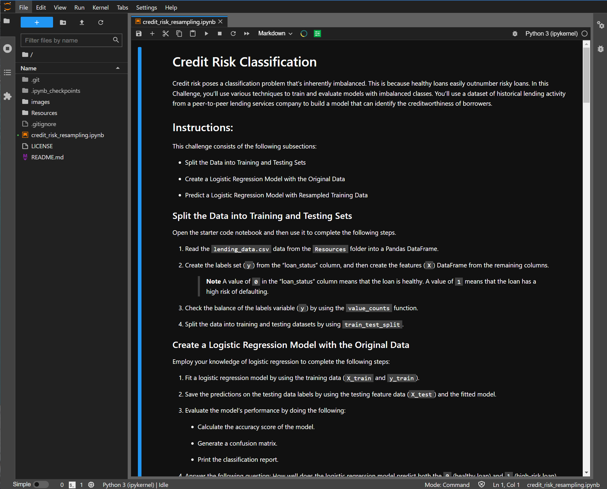

# Risky Loan Assessment with Supervised Learning

Uses an imbalanced logistic regression model to predict the health score of a borrower's loan.

<div class="row">
  <div class="column">
      
    </div>
</div>


> Compares key performance metrics between two logistic regression models for predicting a loan to be risky or healthy. 

## Overview of the Analysis

Correctly identifying high-risk borrowers/loans is important for maintaining the financial security and well-being for potential lenders, venture funds, and investors in debt securities.  The number of high-risk loans is greatly outweighed by the number of healthy loans, and thus, it is often difficult to correctly identify these loans until it is too late.  Fortunately, a supervised machine learning model can be trained on loan data to correctly identify high risk loans.  

* The purpose of this analysis is to evaluate the performance of a Machine Learning Logistic Regression Model on identifying the health of a set a loans.  The model will be fit on both the original dataset of loan data, as well as an oversampled loan data set.  The oversampling will be performed on the minority data group, that is, the high-risk loans.

* The features of this model will include:
    1) Loan Size
    2) Interest Rate
    3) Borrower's Income
    4) Debt to Income Ratio
    5) Number of Accounts
    6) Derogatory Marks on Record
    7) Total Debt

* The machine learning model will then predict the loan status.  For this data set, a loan status of 0 is a healthy loan, while a loan status of 1 is a high-risk loan.

* In the original dataset, in performing a ```value_counts``` on the loan status, the dataset consists of 75,036 healthy loans and 2,500 high-risk loans.  Thus, the majority data set is the healthy loan set (0), and the minority data set is the high-risk loans (1).

* This analysis will consider the logistic regression model for predicting the loan status from the features.  It will follow the standard machine learning practice of initializing the model, fiting the model, using the model to predict loan status outcomes, and comparing the predictions to the known values.  The analysis will be run two times as follows:

    1)  Logistic Regression Model with Original Data - In order to properly fit and test the loan data, the data set will be split using the ```train_test_split``` method from ```sklearn.model_selection```.  This will split the loan data into a training set (75 %) and a testing set (25 %).  The training set will be used to fit the logistic regression model.  The test set will then be used to generate predicted outcomes, as well as known values for evaluating those predictions.
    
    2)  Logistic Regression Model with Oversampled Data - To compensate for the imbalance between healthy loans and high-risk loans, the ```RandomOverSampler``` will be run on the original data's training data.  After running the oversampling, the training data consists of an equal number of high-risk and healthy loans (56,271).  This oversampled training data is then used to fit the logistic regression model.  The original test set will then be used to generate predicted outcomes, as well as known values for evaluating those predictions.

* After both of these models have run, their results will be compared using a balanced accuracy score, a confusion matrix, and an imbalanced classification report.

---
## Technologies

This project is written using a ```Jupyter Lab 3.2.1``` notebook running  ```Python 3.7.11```.  The key libaries are the ```scikit-learn 1.0.2``` for implementing the logistic regression model and the ```imbalanced-learn 0.7.0``` for implementing the oversampling of the minority dataset and imbalanced classification reports.

---

## Installation Guide

Before running the application, first install the following packages if you don't already have them installed in your development environment.

```python
  pip install jupyterlab
```
The scikit-learn libary is automatically installed with the Anaconda installation.  To confirm the install and version number of your scikit-learn libary, run the following command on your command line:
```python
conda list scikit-learn
```
If scikit-learn is not already installed in your environment, run the following in your command line:
```python
pip install -U scikit-learn
```
The imbalance-learn library can be installed running the following command in your terminal:
```python
conda install -c conda-forge imbalanced-learn
```
To verify a successful installation and version number, run the following after installation:
```python
conda list imbalanced-learn
```
After a successful installation, ```cd``` into the top folder of the repository.  Then open ```Jupyter Lab``` by typing:
```python
jupyter lab
```
The analysis is performed in the jupyter notebook file named ```credit_risk_resampling.ipynb```.  

---

## Usage

To view the jupyter notebook used in this analysis, open the ```credit_risk_resampling.ipynb``` file in a jupyter notebook and run the cells.

The notebook should look like the screenshot below:




## Results

After initializing the Logistic Regression models, the loan data is used to fit the models using the ```train_test_split``` function.  Below are the balanced accuracy scores, precision, and recall scores for each of the two models applied.

* Machine Learning Logistic Regression Model with Original Data:
 
  | Loan Health | Accuracy | Precision  | Recall | f1 | 
  | -------:          |  :--------:  |   :------:    | :------:  |:-------:  |
  | Healthy (0):  |   95 %  |     100 %   |   99 % | 100 % |
  | High-Risk (1):|   -same-  |    85 %   |   91 % | 88 %  |

    * The logistic regression correctly predicts both the healthy loan and high-risk loans with an accuracy of around 95%.

    * The model is more precise in correctly predicting healthy loans from high risk loans with 100% precision. The model's precision for predicting high risk loans is at 85 %. This can be attributed to the imbalanced number of high-risk loans (minority set) to healthly loans (majority set).

    * The model is also better at correctly identifying the healthy loans from the actual number of healthy loans (99%). For the higher risk loans, the model identifies around 91% of the high-risk loans from the actual number.


* Machine Learning Logistic Regression Model with Resampled Training Data:

  | Loan Health | Accuracy | Precision  | Recall | f1 | 
  | --------:          |  :-------:  |   :------:    | :------:  |:-------:  |
  | Healthy (0):  |   99 %  |     100 %   |   99 % | 100 % |
  | High-Risk (1):|   -same-  |    84 %   |   99 % | 91 %  |

    * The logistic regression, fit with oversampled date, has a much higher accuracy than the original model with an accuracy of around 99%.

    * The oversampled model is as precise for correctly predicting healthy loans from high risk loans with 100% precision. However, the oversampled model's precision for predicting high risk loans fell slightly to 84%. Since there are a greater number of high risk loans in the oversampled dataset, the oversampled model is overly sensitive towards this type of loan and looses some of its precision in correctly identifying this loan type from a healthy loan.

    * The oversampled model is much better at correctly identifying the healthy loans from the actual number of healthy loans (99%), as well as the high-risk loans in the actual pool of high-risk loans. The oversampled model has a 9% increase above the original model in correctly identifying the high-risk loans from the actual high-risk loans.

## Summary


* Of the two models considered, the oversampled model outperforms the logistic regression model on the original data set.  The oversampled model improves the overall accuracy of the model by 4%, increases the recall by 9%, and the f1-score by 3%.  While the oversampled model does sacrifice 1% of precision for high-risk loans, it is much better at correctly identifying the number of actual high-risk loans, while minimizing the false negatives.  This implies less high-risk loans slip through the algorithm's prediciton abilities. 

* It is important to note the performance and evaluation of these models are highly dependent on their intended applications.  For instance, in this example, high-risk loans (1) are deemed as more important in identification as healthy loans (0).  Financially for a lender, it is more detrimental if a borrower defaults on their high-risk loan, than if a potential healthy loan is denied for being incorrectly identified as high risk.  Therefore, the recall metric for high-risk loans is worth optimizing for the high-risk loans at the small expense of the precision metric.

* Thus the recommended machine learning method for evaluating high-risk loans with these data features is the **Logistic Regression Model with Resampled Training Data**.

## Data Sources

The lending data used in this report can be found in the Resources directory: ```./Resources/lending_data.csv```.  The data is provided by the course materials from a UCBerkeley Fintech Extension program.  

---

## Contributors

The seed code is from the course material from a UCBerkeley Extension program.  This analysis is written and performed by John Gruenewald.<br><br>
For more information, contact **John Gruenewald**:<br>
**e-mail:** [john.h.gruenewald@gmail.com](mailto:john.h.gruenewald@gmail.com)<br> **linked-in:**  [jhgruenewald](https://www.linkedin.com/in/jhgruenewald/)<br>**twitter:**  [@GruenewaldJohn](https://twitter.com/GruenewaldJohn)<br>**medium:**  [@comput99](https://medium.com/@comput99)

---

## License

MIT License

Copyright (c) 2022 John Gruenewald